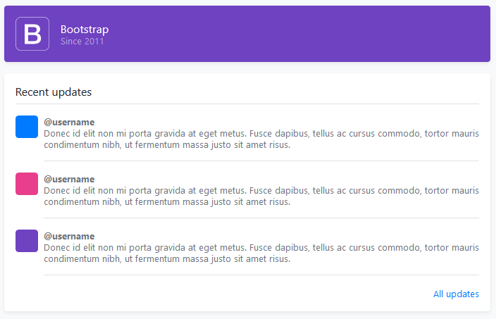
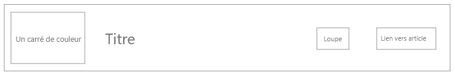
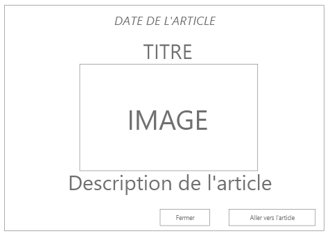
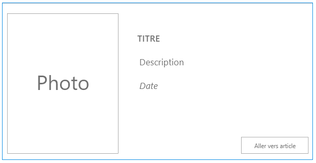

# Super Rss Reader

Vous allez créer un site permettant d’afficher le contenu de plusieurs flux RSS sur une même grande thématique :

- Sport
- Technologie / numérique
- Actualités
- Jeux Videos

Les sources se trouvent à cette adresse :
- *<https://www.01net.com/info/flux-rss/>*
- *<https://rmcsport.bfmtv.com/rss/>*
- *<https://www.jeuxactu.com/rss/>*
- *<https://www.lemonde.fr/actualite-medias/article/2019/08/12/les-flux-rss-du-monde-fr_5498778_3236.html>*

Parmi ces flux seuls **5** sujets vont devoir être selectionnés et uniquement **3** seront affichables selon les préférences du user :  
***ex. pour 01net : Produits, Dossiers, etc. ...***

Vous allez devoir faire un vhost : www.myrssfeed.info  

**!!!!!!! ET SURTOUT MOBILE FIRST !!!!!!!**

**Voici la structure de votre site :**

- /assets
  - /img
  - /script
      - script.js
  - /style
    - style.css
- /controllers
  - index-controller.php
  - pages-controller.php
  - parameters-controller.php
- /views
  - parameters.php
  - pages.php
- 404.php
- index.php
- .htaccess

## Accueil : index.php

Sur la page d'accueil nous devons retrouver :
- le nom / logo du site.
- un carousel **de 3 éléments** qui prends les derniers articles de vos flux rss selectionnés.
- le flux d'actualité de vos choix rss entremêlés.

### La Navbar

Une navbar pour naviguer/choisir les différents sujets cités plus hauts.  
Dans celle-ci, nous devons donc voir afficher :

- Les 3 sujets sélectionnés dans les préférences. (*détails plus bas*).
- Un bouton paramètre permettant de modifier les préférences utilisateurs.

### Le custom des paramètres

Faire une formulaire permettant de personnaliser son lecteur de flux rss.

- **Choix** du design du site : *faire un mode dark :) oui je sais c'est à la mode*
- **Nombre** d’articles affichés sur la page d’accueil : 6 / 9 / 12
- **Choix** des sujets sous forme de checkbox (proposer 5 choix) : Nous verrons donc les 3 sujets cochés.

***!! ASTUCE !! N'oubliez pas de manger des cookies***

### Le corps du flux d'actualité

- Sous le carousel, le fil d'actualité (*selon les sujets*), sous cette forme : 
  

### ZOOM sur le "fil d'actus"

Les articles du fil d'actus sera cette forme :  
 

- Une couleur correspondant au sujet.
- Le titre de l'actualité.
- Un bouton loupe : Qui va ouvrir une modal.
- Un bouton lien : Qui ouvrira directement l'article.  

La modal sera sous cette forme :  
  

- **Date en français de l’article.**
- Titre de l’article.
- Image de l’article.
- Description de l'article.
- Un bouton pour fermer la modal.
- Un bouton/lien pour ouvrir l’url de l’article.

## pages.php : "*lorsque nous cliquons sur un sujet dans la navbar*"

- Afficher dans *pages.php* **uniquement** le fil d'actus du sujet correspondant.  
- Cependant : Tous les sujets seront présents sous formes de **"cartes horizontales"**  

## URL Rewriting : Personnalisation des URLs

Faire en sorte que :

- *accueil.html* correspond à index.php
- *parametre.html* correspond à parameters.php
- *sujet1.html* correspond à pages.php avec le sujet sujet1
- *sujet2.html* correspond à pages.php avec le sujet sujet2
- etc ...
- **... penser à que tous les 5 sujets soient disponibles en URL**

## DERNIER DETAIL

Il faut faire en sorte de disposer **d'une page erreur 404 personnalisée**.

> **A vous de jouer !!!** 😊 Go! Go! Go!
